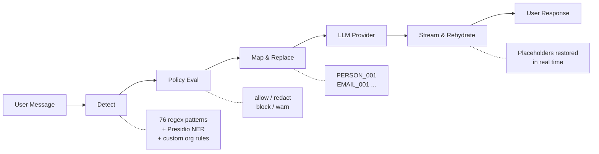

# VeilProxy

[](https://github.com/Threatlabs-LLC/veil-public/actions/workflows/ci.yml)
[](https://github.com/Threatlabs-LLC/veil-public/pkgs/container/veil-public)
[](LICENSE)
[](https://www.python.org/)
[](https://react.dev/)
[](docker-compose.yml)

VeilProxy is an enterprise LLM sanitization proxy that sits between your application and any LLM provider. It detects sensitive data -- names, emails, SSNs, credit card numbers, API keys, and dozens more entity types -- replaces them with consistent placeholders, forwards the sanitized text to the LLM, and rehydrates the response before it reaches the user. The AI never sees your real data.

```
User: "John Smith at john@acme.com called from 192.168.1.50"
  |  VeilProxy detects and replaces
LLM:  "PERSON_001 at EMAIL_001 called from IP_ADDRESS_001"
  |  LLM responds using placeholders
User: "John Smith's email john@acme.com was confirmed"  <-- rehydrated
```

## Why VeilProxy?

| | VeilProxy | Custom Regex | Private AI (Opaque) | Portkey |
|---|---|---|---|---|
| **76 built-in patterns** | Yes | You build them | Limited | No sanitization |
| **NER (spaCy/Presidio)** | Yes | No | Yes | No |
| **Policy engine (allow/redact/block/warn)** | Yes | No | Partial | No |
| **Streaming rehydration** | Yes | No | No | N/A |
| **OpenAI-compatible gateway** | Yes | No | No | Yes |
| **Multi-provider (OpenAI, Anthropic, Ollama)** | Yes | Manual | Limited | Yes |
| **Self-hosted / air-gapped** | Yes | Yes | No (SaaS) | No (SaaS) |
| **Open source** | Yes (BSL-1.1) | N/A | No | Partial |
| **Custom org rules** | Yes | Manual | No | No |
| **Audit logging + webhooks** | Yes | No | Partial | Yes |

## Key Features

- **76 built-in detection patterns** -- Regex-based detection for PII, financial data, credentials, log-file secrets, and more, with optional Presidio/spaCy NER for deeper coverage
- **Log-file PII detection** -- Detects secrets in infrastructure logs: Azure/GCP/AWS keys, ODBC/JDBC connection strings, SendGrid, Twilio, Datadog, SSH/SCP URIs, Kubernetes tokens, Docker configs, CIDR ranges, session IDs, and X-Forwarded-For headers
- **Policy engine** -- Configure per-entity-type actions: allow, redact, block, or warn, with customizable confidence thresholds
- **Multimodal streaming** -- SSE streaming with chunk-boundary placeholder rehydration; supports text and image content (image_url, image_base64) with responses arriving instantly
- **OpenAI-compatible gateway** -- Drop-in replacement at `/v1/chat/completions`; change one line of code and all existing integrations work
- **OpenAI Responses API** -- Image generation and multimodal responses via `POST /v1/responses` for image-capable models
- **Multi-provider support** -- OpenAI, Anthropic, Ollama, and any OpenAI-compatible API endpoint
- **Document scanning** -- Upload and scan PDF, DOCX, CSV, XLSX, and TXT files for sensitive data (processed in-memory, never stored)
- **Audit logging and webhooks** -- Full event bus with async webhook delivery for compliance and monitoring
- **Multi-user with RBAC** -- Organization-scoped users with role-based access control, Google OAuth, and password reset
- **Custom detection rules** -- Define organization-specific regex or dictionary patterns through the admin UI or API
- **Self-hosted via Docker** -- Docker Compose with Redis for distributed state, SQLite by default, PostgreSQL for enterprise scale

## Quick Start

### 1. Clone the repository

```bash
git clone https://github.com/Threatlabs-LLC/veil-public.git
cd veil-public
```

### 2. Configure environment

```bash
cp .env.example .env
```

Edit `.env` and set at minimum:

```bash
VEILCHAT_SECRET_KEY=your-random-secret-key
VEILCHAT_OPENAI_API_KEY=sk-your-key-here       # or use Anthropic/Ollama instead
```

### 3. Start with Docker Compose

```bash
docker compose up -d
```

### 4. Open the app

Navigate to [http://localhost:8000](http://localhost:8000). Register your first account -- the first user becomes the organization admin.

For fully air-gapped deployments, point VeilProxy at a local Ollama instance:

```bash
VEILCHAT_OLLAMA_BASE_URL=http://host.docker.internal:11434/v1
```

## Gateway Mode

VeilProxy exposes an OpenAI-compatible API at `/v1/chat/completions`. Point any existing OpenAI SDK integration at VeilProxy by changing a single line:

```python
from openai import OpenAI

client = OpenAI(
    base_url="http://localhost:8000/v1",   # <-- point to VeilProxy
    api_key="vk_your_api_key",
)

response = client.chat.completions.create(
    model="gpt-4o",
    messages=[{"role": "user", "content": "Summarize this customer record..."}],
)
# PII was sanitized before reaching OpenAI, response was rehydrated
print(response.choices[0].message.content)
```

Works with LangChain, LlamaIndex, Cursor, Continue, and any OpenAI-compatible client. All outbound requests are sanitized automatically. Responses are rehydrated before they reach your code. No other changes required.

## How It Works



<details>
<summary>Text-based diagram (non-GitHub viewers)</summary>

```
User message
  |
  v
Detect (76 regex patterns + Presidio NER + custom org rules)
  |
  v
Policy evaluation (allow / redact / block / warn per entity type)
  |
  v
Map entities to consistent placeholders (PERSON_001, EMAIL_001, ...)
  |
  v
Forward sanitized text to LLM provider
  |
  v
Stream response back, rehydrating placeholders in real time
  |
  v
User receives clean response with original data restored
```

</details>

Placeholders are consistent within a session -- if "John Smith" maps to `PERSON_001`, every occurrence is replaced and restored the same way, preserving context across multi-turn conversations.

## Configuration

All environment variables use the `VEILCHAT_` prefix. See [`.env.example`](.env.example) for the full list with comments.

| Variable | Required | Description |
|----------|----------|-------------|
| `VEILCHAT_SECRET_KEY` | Yes | JWT signing key (use a long random string) |
| `VEILCHAT_OPENAI_API_KEY` | No | OpenAI API key |
| `VEILCHAT_ANTHROPIC_API_KEY` | No | Anthropic API key |
| `VEILCHAT_OLLAMA_BASE_URL` | No | Ollama endpoint (default: `http://localhost:11434/v1`) |
| `VEILCHAT_DATABASE_URL` | No | Default: SQLite. Use `postgresql+asyncpg://...` for production |
| `VEILCHAT_GOOGLE_CLIENT_ID` | No | Google OAuth client ID for "Continue with Google" |
| `VEILCHAT_GOOGLE_CLIENT_SECRET` | No | Google OAuth client secret |
| `VEILCHAT_SMTP_HOST` | No | SMTP server for password reset emails |
| `VEILCHAT_SMTP_FROM_EMAIL` | No | From address for outbound emails |

## Documentation

- [API Reference](docs/API.md) -- Full endpoint documentation
- [Architecture](docs/ARCHITECTURE.md) -- System design and sanitization pipeline
- [Deployment Guide](docs/DEPLOYMENT.md) -- Docker, Kubernetes, and reverse proxy configurations
- [`.env.example`](.env.example) -- All configuration options with comments
- [CONTRIBUTING.md](CONTRIBUTING.md) -- Development setup, coding standards, PR process

## Contributing

We welcome contributions. See [CONTRIBUTING.md](CONTRIBUTING.md) for development setup instructions, coding standards, and the pull request process.

```bash
# Quick dev setup
git clone https://github.com/Threatlabs-LLC/veil-public.git && cd veil-public
pip install -e ".[dev]"
cd frontend && npm install && cd ..
cp .env.example .env
uvicorn backend.main:app --host 0.0.0.0 --port 8000 --reload
```

## Community

- [GitHub Issues](https://github.com/Threatlabs-LLC/veil-public/issues) -- Bug reports and feature requests
- [GitHub Discussions](https://github.com/Threatlabs-LLC/veil-public/discussions) -- Questions, ideas, show & tell
- [Changelog](https://github.com/Threatlabs-LLC/veil-public/releases) -- Release notes and what's new
- [Substack](https://veilproxy.substack.com) -- Blog, tutorials, and product updates

## Cloud Version

For managed hosting with no infrastructure to maintain, visit [app.veilproxy.ai](https://app.veilproxy.ai). The cloud version includes automatic updates, PostgreSQL storage, and priority support.

## License

VeilProxy is licensed under the [Business Source License 1.1](LICENSE) (BSL-1.1).

**What this means:** You can use, modify, and self-host VeilProxy freely for your own internal purposes. The BSL restricts offering it as a competing managed service. The code converts to Apache 2.0 on February 20, 2030. For commercial licensing or enterprise deployments, contact [support@veilproxy.ai](mailto:support@veilproxy.ai).

---

Built by [Threatlabs LLC](https://github.com/Threatlabs-LLC) -- [veilproxy.ai](https://veilproxy.ai)

<a href="https://star-history.com/#Threatlabs-LLC/veil-public&Date">
  <picture>
    <source media="(prefers-color-scheme: dark)" srcset="https://api.star-history.com/svg?repos=Threatlabs-LLC/veil-public&type=Date&theme=dark" />
    <source media="(prefers-color-scheme: light)" srcset="https://api.star-history.com/svg?repos=Threatlabs-LLC/veil-public&type=Date" />
    
  </picture>
</a>
