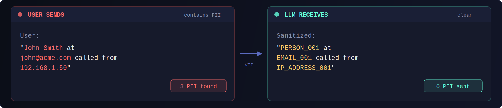
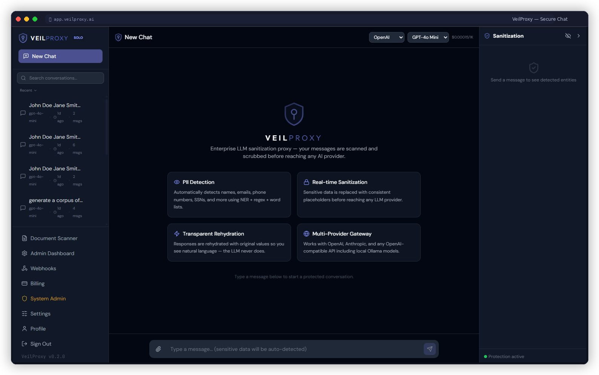
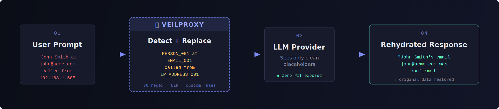
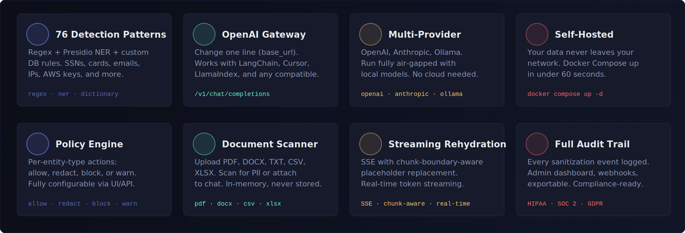

<p align="center">
  
</p>

<p align="center">
  <a href="https://github.com/Threatlabs-LLC/veil-public/blob/master/LICENSE"></a>
  <a href="#"></a>
  <a href="#"></a>
  <a href="#"></a>
  <a href="#testing"></a>
  <a href="https://veilproxy.ai"></a>
  <a href="https://app.veilproxy.ai"></a>
</p>

<p align="center">
  Enterprise LLM sanitization proxy — intercepts messages to AI providers, detects and replaces PII with consistent placeholders, forwards sanitized content, and rehydrates responses. <strong>The LLM never sees real data.</strong>
</p>

<br/>

<p align="center">
  
</p>

<br/>

<p align="center">
  
</p>

---

## Quick Start

### 1. Clone the repository

```bash
git clone https://github.com/Threatlabs-LLC/veil-public.git
cd veil-public
```

### 2. Configure environment

```bash
cp .env.example .env
```

Edit `.env` and set at minimum:

```bash
VEILCHAT_SECRET_KEY=your-random-secret-key
VEILCHAT_OPENAI_API_KEY=sk-your-key-here       # or use Anthropic/Ollama instead
```

### 3. Start with Docker Compose

```bash
docker compose up -d
```

### 4. Open the app

Navigate to [http://localhost:8000](http://localhost:8000). Register your first account -- the first user becomes the organization admin.

For fully air-gapped deployments, point VeilProxy at a local Ollama instance:

```bash
VEILCHAT_OLLAMA_BASE_URL=http://host.docker.internal:11434/v1
```

---

## How It Works

<p align="center">
  
</p>

```
User: "John Smith at john@acme.com called from 192.168.1.50"
  |  VeilProxy detects and replaces
LLM:  "PERSON_001 at EMAIL_001 called from IP_ADDRESS_001"
  |  LLM responds using placeholders
User: "John Smith's email john@acme.com was confirmed"  <-- rehydrated
```

Placeholders are consistent within a session -- if "John Smith" maps to `PERSON_001`, every occurrence is replaced and restored the same way, preserving context across multi-turn conversations.

---

## Key Features

<p align="center">
  
</p>

- **76 built-in detection patterns** -- Regex-based detection for PII, financial data, credentials, log-file secrets, and more, with optional Presidio/spaCy NER for deeper coverage
- **Log-file PII detection** -- Detects secrets in infrastructure logs: Azure/GCP/AWS keys, ODBC/JDBC connection strings, SendGrid, Twilio, Datadog, SSH/SCP URIs, Kubernetes tokens, Docker configs, CIDR ranges, session IDs, and X-Forwarded-For headers
- **Policy engine** -- Configure per-entity-type actions: allow, redact, block, or warn, with customizable confidence thresholds
- **Multimodal streaming** -- SSE streaming with chunk-boundary placeholder rehydration; supports text and image content types with responses arriving instantly
- **OpenAI-compatible gateway** -- Drop-in replacement at `/v1/chat/completions`; change one line of code and all existing integrations work
- **Multi-provider support** -- OpenAI, Anthropic, Ollama, and any OpenAI-compatible API endpoint
- **Document scanning** -- Upload and scan PDF, DOCX, CSV, XLSX, and TXT files for sensitive data (processed in-memory, never stored)
- **Audit logging and webhooks** -- Full event bus with async webhook delivery for compliance and monitoring
- **Multi-user with RBAC** -- Organization-scoped users with role-based access control, Google OAuth, and password reset
- **Custom detection rules** -- Define organization-specific regex or dictionary patterns through the admin UI or API
- **Self-hosted via Docker** -- Docker Compose with Redis for distributed state, SQLite by default, PostgreSQL for enterprise scale

---

## Why VeilProxy?

| Feature | VeilProxy | Nightfall AI | LLM Guard | Strac | Endpoint DLP |
|:--------|:---------:|:------------:|:---------:|:-----:|:------------:|
| **Self-hosted** | Yes | No | Yes | No | Agent-based |
| **Open-source** | Yes (BSL 1.1) | No | Yes (Apache) | No | No |
| **Built-in Chat UI** | Yes | No | No | No | No |
| **OpenAI-compatible gateway** | Yes | No | No | No | No |
| **Reversible pseudonymization** | Yes | No | No | No | No |
| **Deploy time** | 60 sec | Weeks | Hours | Days | Weeks |
| **Free tier** | Forever | No | Yes (lib) | Limited | No |
| **Air-gap / Ollama** | Yes | No | Partial | No | N/A |
| **Document scanning** | Yes | Yes | No | No | Yes |
| **Streaming SSE** | Yes | No | No | No | N/A |

---

## Gateway Mode

VeilProxy exposes an OpenAI-compatible API at `/v1/chat/completions`. Point any existing OpenAI SDK integration at VeilProxy by changing a single line:

```python
from openai import OpenAI

client = OpenAI(
    base_url="http://localhost:8000/v1",   # <-- point to VeilProxy
    api_key="vk_your_api_key",
)

response = client.chat.completions.create(
    model="gpt-4o",
    messages=[{"role": "user", "content": "Summarize this customer record..."}],
)
# PII was sanitized before reaching OpenAI, response was rehydrated
print(response.choices[0].message.content)
```

Works with LangChain, LlamaIndex, Cursor, Continue, and any OpenAI-compatible client. All outbound requests are sanitized automatically. Responses are rehydrated before they reach your code. No other changes required.

---

## Architecture

```mermaid
flowchart LR
    subgraph USER["User"]
        A["Prompt with PII"]
    end

    subgraph VEIL["VeilProxy"]
        direction TB
        B["Detect<br/><small>76 regex + NER + custom rules</small>"]
        C["Policy Engine<br/><small>allow / redact / block / warn</small>"]
        D["Map to Placeholders<br/><small>PERSON_001 / EMAIL_001</small>"]
        B --> C --> D
    end

    subgraph LLM["LLM Provider"]
        E["Sees only<br/>clean placeholders"]
    end

    subgraph RESPONSE["Response"]
        F["Rehydrated<br/>original data restored"]
    end

    A -->|"raw prompt"| B
    D -->|"sanitized"| E
    E -->|"response"| F

    style USER fill:#161A2B,stroke:#2A2F45,color:#E8EAED
    style VEIL fill:#161A2B,stroke:#5B6BC0,color:#E8EAED
    style LLM fill:#161A2B,stroke:#2A2F45,color:#E8EAED
    style RESPONSE fill:#161A2B,stroke:#64FFDA,color:#E8EAED
```



**Stack**: Python 3.12 / FastAPI / SQLAlchemy async / React 19 / TypeScript / Vite / Tailwind CSS

**Database**: SQLite WAL (dev/self-hosted) or PostgreSQL + asyncpg (enterprise)

**Auth**: JWT + bcrypt + Google OAuth + SMTP password reset

---

## Configuration

All environment variables use the `VEILCHAT_` prefix. See [`.env.example`](.env.example) for the full list with comments.

| Variable | Required | Description |
|----------|----------|-------------|
| `VEILCHAT_SECRET_KEY` | Yes | JWT signing key (use a long random string) |
| `VEILCHAT_OPENAI_API_KEY` | No | OpenAI API key |
| `VEILCHAT_ANTHROPIC_API_KEY` | No | Anthropic API key |
| `VEILCHAT_OLLAMA_BASE_URL` | No | Ollama endpoint (default: `http://localhost:11434/v1`) |
| `VEILCHAT_DATABASE_URL` | No | Default: SQLite. Use `postgresql+asyncpg://...` for production |
| `VEILCHAT_GOOGLE_CLIENT_ID` | No | Google OAuth client ID for "Continue with Google" |
| `VEILCHAT_GOOGLE_CLIENT_SECRET` | No | Google OAuth client secret |
| `VEILCHAT_SMTP_HOST` | No | SMTP server for password reset emails |
| `VEILCHAT_SMTP_FROM_EMAIL` | No | From address for outbound emails |

---

## Development Setup

**Prerequisites**: Python 3.12+, Node.js 18+

```bash
# Backend
pip install -e ".[dev]"
uvicorn backend.main:app --reload --port 8000

# Frontend (separate terminal)
cd frontend
npm install
npm run dev
```

---

## Testing

```bash
python -m pytest backend/tests/ -v
```

792 tests across 20 test files. Covers detection accuracy, security hardening, performance benchmarks, API route coverage, core pipeline logic, policy engine, PII corpus testing across 12 real-world log formats, and multimodal streaming.

---

## Documentation

| Document | Description |
|:---------|:-----------|
| [API Reference](https://veilproxy.ai/docs/) | Full endpoint documentation |
| [Deployment Guide](https://veilproxy.ai/deploy/) | Docker, Kubernetes, and reverse proxy configurations |
| [`.env.example`](.env.example) | All configuration options with comments |
| [CONTRIBUTING.md](CONTRIBUTING.md) | Development setup, coding standards, PR process |

---

## Contributing

We welcome contributions. See [CONTRIBUTING.md](CONTRIBUTING.md) for development setup instructions, coding standards, and the pull request process.

---

## Community

- [GitHub Issues](https://github.com/Threatlabs-LLC/veil-public/issues) -- Bug reports and feature requests
- [GitHub Discussions](https://github.com/Threatlabs-LLC/veil-public/discussions) -- Questions, ideas, show & tell
- [Changelog](https://github.com/Threatlabs-LLC/veil-public/releases) -- Release notes and what's new
- [Substack](https://veilproxy.substack.com) -- Blog, tutorials, and product updates

---

## Cloud Version

For managed hosting with no infrastructure to maintain, visit [app.veilproxy.ai](https://app.veilproxy.ai). The cloud version includes automatic updates, PostgreSQL storage, and priority support.

---

## License

VeilProxy is licensed under the [Business Source License 1.1](LICENSE) (BSL-1.1).

**What this means:** You can use, modify, and self-host VeilProxy freely for your own internal purposes. The BSL restricts offering it as a competing managed service. The code converts to Apache 2.0 on February 20, 2030. For commercial licensing or enterprise deployments, contact [support@veilproxy.ai](mailto:support@veilproxy.ai).

---

<p align="center">
  
</p>

<p align="center">
  <sub>Built by <a href="https://github.com/Threatlabs-LLC">Threatlabs LLC</a> · <a href="https://veilproxy.ai">veilproxy.ai</a> · <a href="https://app.veilproxy.ai">Try Cloud</a></sub>
</p>

<a href="https://star-history.com/#Threatlabs-LLC/veil-public&Date">
  <picture>
    <source media="(prefers-color-scheme: dark)" srcset="https://api.star-history.com/svg?repos=Threatlabs-LLC/veil-public&type=Date&theme=dark" />
    <source media="(prefers-color-scheme: light)" srcset="https://api.star-history.com/svg?repos=Threatlabs-LLC/veil-public&type=Date" />
    
  </picture>
</a>
